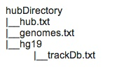

# Basic UCSC track hub

### Configuration:
This pipeline will produce the basic track hub for UCSC sessions. In the ```config.yaml``` you can specify where to create files to within your public directory.

### Output folder:
When running the pipeline, ```results``` folder will be automatically generated inside the folder named adequately inside the configuration file with information where the basic track hub is created and the url to copy and paste to create the UCSC session.

### Run snakemake:
- Run snakemake selecting number of cores (for parallelisation purpose) ``` snakemake --configfile=config/analysis.yaml all --cores 1```

##### Run snakemake (slurm)
- Modify parameters of ```submit.sh```
- Submit job ```sbatch submit.sh```

<hr>

### Hub explanation:
Now that you have a working hub copied from above, you can edit the three main text documents. Here is an example of Hub directory in your public folder:


  
You need to edit the following files:
- ```hub.txt``` with the main information of the created hub directory and your email,
- ```hg19/trackDb.txt``` with the track of your bigwig files (i.e., copy and paste the trackDb.txt that can be generated using either Bulk-ATAC-Seq, ChIP-Seq, or ChIP-Seq-Calibrated pipelines).

whereas ```genome.txt``` does not need any changes.
