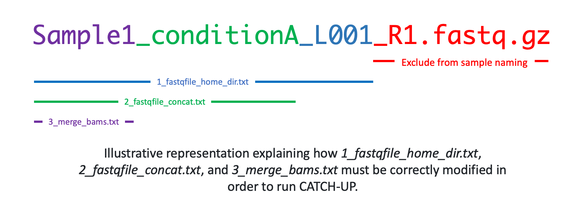

# Bulk ChIP and ATAC sequencing upstream analysis

### Note:
- This pipeline works with both single and paired-end fastq data.
- This pipeline will run all the analyses in this folder, within the ```config/analysis.yaml``` you can specify where to move all the final analysis files to within your directory and if you would like to delete any intermediate files.

### Before starting:
Fasqt names have to be in the following format: 
```<Sample-name>_<condition>_<lane>_<read>.fastq.gz```

If not in this format, run ```modify_fastq_names.py``` to correct their names. In order to run the script, run as follows:

    python modify_fastq_names.py <path-to-fastq-directory>

### Configuration:
- The ```config/analysis.yaml``` indicates the *key*-*value* configuration with the respective documentation (open and follow carefully).


  
- In ```1_fastqfile_home_dir.txt``` must be specified sample names without including read numbers and extension (i.e., *_R1/_R2* and *.fastq.gz*), for example for the following fastq files (single-end sample's names must end with *.fastq.gz*, whilst paired-end with *_R+.fastq.gz*, and they must be stored in the same directory):
    ```
        Sample1_conditionA_L001_R1.fastq.gz
        Sample1_conditionA_L001_R2.fastq.gz
        Sample1_conditionA_L002_R1.fastq.gz
        Sample1_conditionA_L002_R2.fastq.gz
        Sample1_conditionB_L001_R1.fastq.gz
        Sample1_conditionB_L001_R2.fastq.gz
        Sample1_conditionB_L002_R1.fastq.gz
        Sample1_conditionB_L002_R2.fastq.gz
        Sample2_conditionA_L001_R1.fastq.gz
        Sample2_conditionA_L001_R2.fastq.gz
        Sample2_conditionA_L002_R1.fastq.gz
        Sample2_conditionA_L002_R2.fastq.gz
        Sample2_conditionB_L001_R1.fastq.gz
        Sample2_conditionB_L001_R2.fastq.gz
        Sample2_conditionB_L002_R1.fastq.gz
        Sample2_conditionB_L002_R2.fastq.gz
    ```
    In addition, the listed samples must be contained in the folder defined in the *fastq_home_dir* key in ```config/analysis.yaml```). Every line should contain one sample as follows:
    ```
        Sample1_conditionA_L001
        Sample1_conditionA_L002
        Sample1_conditionB_L001
        Sample1_conditionB_L002
        Sample2_conditionA_L001
        Sample2_conditionA_L002
        Sample2_conditionB_L001
        Sample2_conditionB_L002
    ```
    Generalisation of ```1_fastqfile_home_dir.txt``` 
- **If concatenating lanes is required** (edit config file *concatenate_fastq* value equal to "True"), in ```2_fastqfile_concat.txt``` define the fastq files' prefixes to be concatenated. If the sequencing is composed of multiple lanes, the user can specify to concatenate them. If the user chooses to concatencate fastqs a common prefix must be specified for the concatenated fastqs. Every line should contain one sample prefix as follows (i.e., a list of all fastq files to be concatenated):
    ```
        Sample1_conditionA
        Sample1_conditionB
        Sample2_conditionA
        Sample2_conditionB
    ```
    (Generalisation of ```3_merge_bams.txt```)
- **If merging of samples is required** (edit config file *merge_bams* value equal to "True"), in ```3_merge_bams.txt``` define the bam files' prefixes to be merged. If the sequencing data is composed of replicates or samples, the user can specify to merge them or carry on the analysis keeping them separate. If the user chooses to merge bams a common prefix must be specified for the merged bams. Every line should contain one sample prefix as follows (i.e., a list of all bams to be merged):
    ```
        Sample1
        Sample2
    ```
    (Generalisation of ```3_merge_bams.txt```)
- There is an option for adapter trimming, which can be specified in the configuration file. The user must provide the correct adapter sequences.

### Output folders:
- When running the pipeline, ```results```, ```QCs```, and ```logs``` folders will be automatically generated with all related outputs inside the folder (*analysis_name*) specified in the configuration file.

### Generating rule plots:
- ```snakemake --configfile=config/analysis.yaml --forceall --dag | dot -Tpdf > dagALL.pdf```
- ```snakemake --configfile=config/analysis.yaml --forceall --rulegraph | dot -Tpdf > dag.pdf```

### Run snakemake:
- Run snakemake selecting number of cores (for parallelisation purpose) ```snakemake --configfile=config/analysis.yaml all --cores 4```

### Run snakemake (slurm):
- Modify parameters of ```submit_upstream.sh```
- Submit job ```sbatch submit_upstream.sh```

### Warning:
!!!) Run or submit the job through the terminal system and not inside e.g. jupyter-lab terminal.
